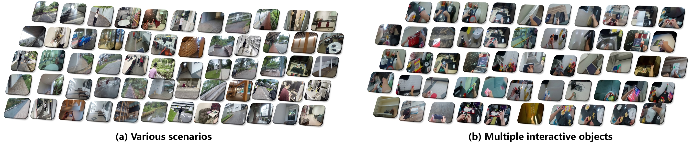
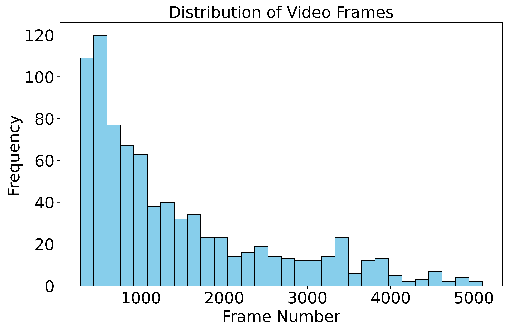

# DRSA-Exo2Ego-VideoSynthesis
For cue-free E2VG problem, we propose a cue-free video-based approach termed hierarchical Dynamic memory Refinement and Semantic Alignment (DRSA). Moreover, we create a new DSO ExoEgo dataset with dynamic exocentric scenes and rich interacting objects to advance the Exocentric-to-Egocentric cross-view Video Generation (E2VG) research.

## DSO ExoEgo Dataset

Our dataset includes 819 exo-ego video pairs, totaling approximately 10.8 hours of episodes (totaling 2,328,054 frames). Here shows some examples of scenarios and interacting objects from the Dynamic Scenes and interacting Objects Exo-Ego (DSO ExoEgo) dataset. Zoom in for details.

    

The length of the video varies from 270 frames to 5,101 frames, as shown in the figure below. The dataset will be publicly released following the article's acceptance to facilitate the E2VG research.

    

Some examples of exocentric and egocentric video pairs from the DSO ExoEgo dataset.

    
    
    

## Experiments Results

