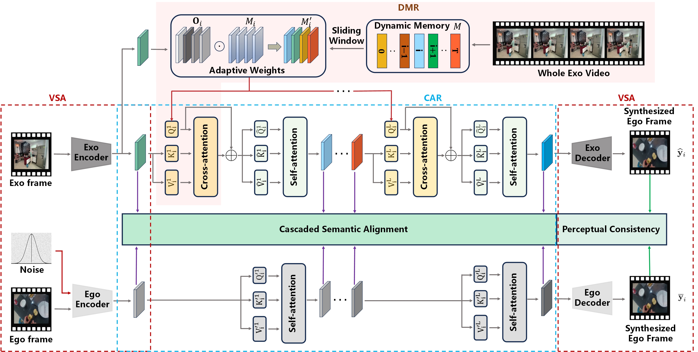
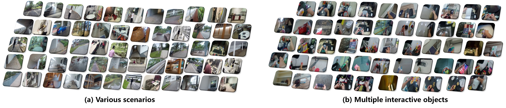

# DRSA-Exo2Ego-Video Synthesis
For cue-free Exocentric-to-Egocentric cross-view Video Generation (E2VG) problem, we propose a cue-free video-based approach termed cascaded Dynamic memory Refinement and Semantic Alignment (DRSA). Moreover, we create a new DSO ExoEgo dataset with dynamic exocentric scenes and rich interacting objects to further promote the E2VG research.

The DRSA consists of three key components: Dynamic Memory Refinement (DMR), Viewpoint-aware Semantic Alignment (VSA), and Cascaded Alignment and Refinement (CAR), which leverages progressive processing of long-horizon temporal knowledge and semantic alignment for high fidelity cross-view generation.

<p align="center">
    
</p>

## Download DSO ExoEgo Dataset

Our dataset includes 819 exo-ego video pairs, totaling approximately 10.8 hours of episodes (2,328,054 frames). Here shows some examples of scenarios and interacting objects from the Dynamic Scenes and interacting Objects Exo-Ego (DSO ExoEgo) dataset. Zoom in for details.

<p align="center">
    
</p>

Some examples of exocentric and egocentric video pairs from the DSO ExoEgo dataset.

<p align="center">
    
    
    
</p>

Some videos in the DSO ExoEgo dataset reveal the complete facial appearance of participants (without mask or hat). In order to safeguard participant privacy, such videos have been withheld from public release.

To access the DSO ExoEgo dataset for academic use, users must first sign the Dataset Release Agreement.
<a href="https://github.com/hwpengTristin/DRSA-Exo2Ego-VideoSynthesis/blob/main/DSOExOEgO_RELEASE_AGREEMENT.pdf">
    
</a> 

Upon approval of the signed agreement, the DSO ExoEgo dataset can be downloaded via Google Drive.
<a href="https://drive.google.com/file/d/1fycEfRNW0yCfcmP77m4biXUcY4XELzus/view?usp=drive_link">
    
</a> 

## Experiments Results

Transformation of video from exocentric to egocentric viewpoints using various methods on the Assembly101 dataset. Upper part: method with target-view cues. Bottom part: method without target-view cues.

<p align="center">
    
</p>


## Inference and Training Code

The code is being prepared and will be open as soon as the paper is accepted. Please stay tuned!

## Citation

```BibTeX
@INPROCEEDINGS{
  author    = {Weipeng Hu, Jiun Tian Hoe, Jianhui Li, Haifeng Hu, Xudong Jiang, Yap-Peng Tan},
  booktitle = {IEEE Transactions on Pattern Analysis and Machine Intelligence},
  title     = {Cascaded Dynamic Memory Refinement and Semantic Alignment for Exo-to-Ego Cross-view Video Generation},
  doi       = {10.1109/TPAMI.2025.3569195},
  year      = {2025},
}
```
